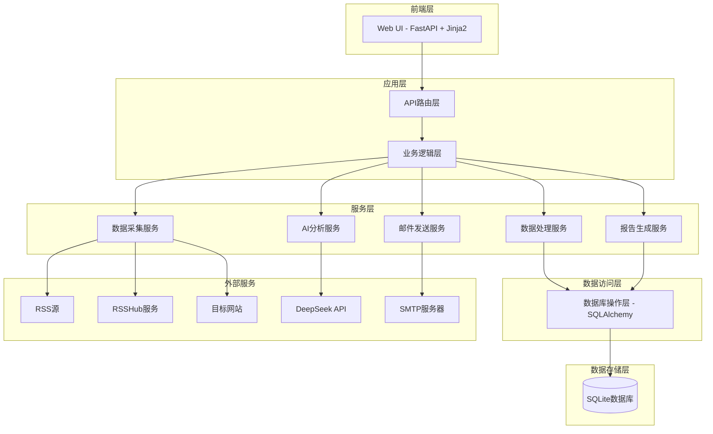

# 设计文档

## 概述

金融日报系统是一个基于Python的自动化信息聚合和分析平台。系统采用模块化架构，包括数据采集层、数据处理层、AI分析层、报告生成层和Web展示层。核心技术栈包括FastAPI、SQLite、feedparser、requests、DeepSeek API、markdown2pdf等。

系统的核心工作流程：
1. 定时任务触发数据采集
2. 多源数据获取（RSS/RSSHub/爬虫）
3. 数据清洗和过滤
4. AI智能摘要
5. 报告生成（HTML/PDF）
6. 邮件发送
7. Web界面展示和管理

## 架构

### 系统架构图



### 技术栈

- **Web框架**: FastAPI（异步高性能）
- **数据库**: SQLite + SQLAlchemy ORM
- **RSS解析**: feedparser
- **网络爬虫**: requests + BeautifulSoup4
- **AI服务**: DeepSeek API（通过HTTP请求）
- **报告生成**: Jinja2模板 + markdown2 + weasyprint/pdfkit
- **邮件发送**: smtplib + email
- **任务调度**: APScheduler
- **配置管理**: PyYAML
- **日志**: logging

### 部署架构

系统采用单机部署模式，所有组件运行在同一服务器上：
- FastAPI应用通过Uvicorn运行
- SQLite数据库文件存储在本地
- 定时任务由APScheduler在后台运行
- 静态文件和模板由FastAPI直接服务

## 组件和接口

### 1. 数据采集模块（Crawler Module）

#### 1.1 基础爬虫类（BaseCrawler）

```python
class BaseCrawler(ABC):
    """爬虫基类，所有爬虫必须继承此类"""
    
    @abstractmethod
    def fetch(self) -> List[Article]:
        """获取文章列表"""
        pass
    
    def validate_content(self, content: str) -> bool:
        """验证内容有效性（字数检查）"""
        return len(content) >= 100
```

#### 1.2 RSS爬虫（RSSCrawler）

```python
class RSSCrawler(BaseCrawler):
    def __init__(self, feed_url: str):
        self.feed_url = feed_url
    
    def fetch(self) -> List[Article]:
        """使用feedparser解析RSS源"""
        pass
```

#### 1.3 RSSHub爬虫（RSSHubCrawler）

```python
class RSSHubCrawler(BaseCrawler):
    def __init__(self, rsshub_base: str, route: str):
        self.rsshub_url = f"{rsshub_base}/{route}"
    
    def fetch(self) -> List[Article]:
        """从RSSHub获取RSS并解析"""
        pass
```

#### 1.4 自定义爬虫（CustomCrawler）

每个需要自定义爬虫的信息源创建独立文件，例如：

```python
# crawlers/xinhua_crawler.py
class XinhuaCrawler(BaseCrawler):
    def fetch(self) -> List[Article]:
        """新华社专用爬虫逻辑"""
        pass
```

#### 1.5 爬虫工厂（CrawlerFactory）

```python
class CrawlerFactory:
    @staticmethod
    def create_crawler(source_config: dict) -> BaseCrawler:
        """根据配置创建相应的爬虫实例"""
        if source_config['type'] == 'rss':
            return RSSCrawler(source_config['url'])
        elif source_config['type'] == 'rsshub':
            return RSSHubCrawler(RSSHUB_BASE, source_config['route'])
        elif source_config['type'] == 'custom':
            return import_custom_crawler(source_config['crawler_class'])
```

### 2. 数据处理模块（Data Processing Module）

#### 2.1 数据清洗器（DataCleaner）

```python
class DataCleaner:
    def filter_by_date(self, articles: List[Article], target_date: date) -> List[Article]:
        """按日期过滤文章（仅保留昨天的）"""
        pass
    
    def filter_by_relevance(self, articles: List[Article]) -> List[Article]:
        """过滤与金融无关的内容"""
        pass
```

#### 2.2 去重器（Deduplicator）

```python
class Deduplicator:
    def remove_duplicates(self, articles: List[Article]) -> List[Article]:
        """基于标题和链接去重"""
        pass
```

### 3. AI分析模块（AI Analysis Module）

#### 3.1 DeepSeek客户端（DeepSeekClient）

```python
class DeepSeekClient:
    def __init__(self, api_key: str, base_url: str):
        self.api_key = api_key
        self.base_url = base_url
    
    def summarize_article(self, content: str, prompt_template: str = None) -> dict:
        """
        生成文章摘要
        返回: {"summary": "...", "keywords": ["...", "..."]}
        """
        pass
    
    def generate_daily_report(self, summaries: dict, prompt_template: str = None) -> str:
        """
        生成每日总报告
        参数: summaries - 按层面分组的摘要字典
        返回: 总报告文本
        """
        pass
```

### 4. 报告生成模块（Report Generation Module）

#### 4.1 报告生成器（ReportGenerator）

```python
class ReportGenerator:
    def generate_html(self, report_data: dict, template: str = "default") -> str:
        """使用Jinja2生成HTML报告"""
        pass
    
    def generate_pdf(self, html_content: str, output_path: str) -> str:
        """将HTML转换为PDF"""
        pass
    
    def generate_markdown(self, report_data: dict) -> str:
        """生成Markdown格式报告"""
        pass
```

### 5. 邮件发送模块（Email Module）

#### 5.1 邮件发送器（EmailSender）

```python
class EmailSender:
    def __init__(self, smtp_config: dict):
        self.smtp_server = smtp_config['server']
        self.smtp_port = smtp_config['port']
        self.username = smtp_config['username']
        self.password = smtp_config['password']
    
    def send_report(self, recipients: List[str], html_content: str, pdf_path: str) -> bool:
        """发送报告邮件"""
        pass
```

### 6. 任务调度模块（Scheduler Module）

#### 6.1 任务调度器（TaskScheduler）

```python
class TaskScheduler:
    def __init__(self):
        self.scheduler = BackgroundScheduler()
    
    def schedule_daily_task(self, hour: int = 8, minute: int = 0):
        """调度每日任务（默认早上8点）"""
        self.scheduler.add_job(
            self.run_daily_pipeline,
            'cron',
            hour=hour,
            minute=minute
        )
    
    async def run_daily_pipeline(self):
        """执行完整的日报生成流程"""
        # 1. 数据采集
        # 2. 数据清洗
        # 3. AI摘要
        # 4. 报告生成
        # 5. 邮件发送
        pass
```

### 7. Web API模块（Web API Module）

#### 7.1 API路由

```python
# FastAPI路由定义
@app.get("/")
async def index():
    """主页 - 显示每日报告列表"""
    pass

@app.get("/reports/{date}")
async def get_report(date: str):
    """获取指定日期的报告"""
    pass

@app.get("/articles/{date}/{category}")
async def get_articles(date: str, category: str):
    """获取指定日期和层面的文章列表"""
    pass

@app.get("/article/{article_id}")
async def get_article_detail(article_id: int):
    """获取文章详情"""
    pass

@app.get("/sources")
async def list_sources():
    """获取所有信息源列表"""
    pass

@app.post("/sources/{source_id}/toggle")
async def toggle_source(source_id: int):
    """启用/停用信息源"""
    pass

@app.post("/sources/add")
async def add_source(source: SourceCreate):
    """添加新信息源"""
    pass

@app.post("/sources/test")
async def test_source(source: SourceTest):
    """测试信息源可用性"""
    pass

@app.get("/emails")
async def list_emails():
    """获取邮件订阅列表"""
    pass

@app.post("/emails/add")
async def add_email(email: EmailCreate):
    """添加订阅邮箱"""
    pass

@app.delete("/emails/{email_id}")
async def delete_email(email_id: int):
    """删除订阅邮箱"""
    pass

@app.post("/custom-report")
async def create_custom_report(config: CustomReportConfig):
    """生成个性化报告"""
    pass
```

## 数据模型

### 数据库表结构

#### 1. 信息源表（sources）

| 字段 | 类型 | 说明 |
|------|------|------|
| id | INTEGER | 主键 |
| name | VARCHAR(200) | 信息源名称 |
| category | VARCHAR(50) | 层面（政治/经济/技术/金融科技） |
| type | VARCHAR(20) | 类型（rss/rsshub/custom） |
| url | TEXT | RSS地址或网站地址 |
| rsshub_route | VARCHAR(200) | RSSHub路由（可选） |
| crawler_class | VARCHAR(100) | 自定义爬虫类名（可选） |
| enabled | BOOLEAN | 是否启用 |
| created_at | DATETIME | 创建时间 |
| updated_at | DATETIME | 更新时间 |

#### 2. 文章表（articles）

| 字段 | 类型 | 说明 |
|------|------|------|
| id | INTEGER | 主键 |
| source_id | INTEGER | 外键 - 信息源ID |
| title | TEXT | 标题 |
| link | TEXT | 链接 |
| content | TEXT | 原始内容 |
| publish_time | DATETIME | 发布时间 |
| saved_at | DATETIME | 保存时间 |
| created_at | DATETIME | 创建时间 |

#### 3. 摘要表（summaries）

| 字段 | 类型 | 说明 |
|------|------|------|
| id | INTEGER | 主键 |
| article_id | INTEGER | 外键 - 文章ID |
| summary | TEXT | AI摘要（100-200字） |
| keywords | TEXT | 关键词（JSON数组） |
| created_at | DATETIME | 创建时间 |

#### 4. 每日报告表（daily_reports）

| 字段 | 类型 | 说明 |
|------|------|------|
| id | INTEGER | 主键 |
| report_date | DATE | 报告日期 |
| political_summary | TEXT | 政治层面总结 |
| economic_summary | TEXT | 经济层面总结 |
| technical_summary | TEXT | 技术层面总结 |
| fintech_summary | TEXT | 金融科技层面总结 |
| overall_summary | TEXT | 总体总结 |
| html_content | TEXT | HTML格式报告 |
| pdf_path | VARCHAR(500) | PDF文件路径 |
| created_at | DATETIME | 创建时间 |

#### 5. 邮件订阅表（email_subscriptions）

| 字段 | 类型 | 说明 |
|------|------|------|
| id | INTEGER | 主键 |
| email | VARCHAR(200) | 邮箱地址 |
| enabled | BOOLEAN | 是否启用 |
| created_at | DATETIME | 创建时间 |

#### 6. 用户配置表（user_configs）

| 字段 | 类型 | 说明 |
|------|------|------|
| id | INTEGER | 主键 |
| user_id | VARCHAR(100) | 用户标识（预留） |
| selected_sources | TEXT | 选中的信息源ID（JSON数组） |
| article_prompt | TEXT | 单篇文章摘要提示词 |
| report_prompt | TEXT | 每日报告提示词 |
| created_at | DATETIME | 创建时间 |
| updated_at | DATETIME | 更新时间 |

### SQLAlchemy模型定义

```python
from sqlalchemy import Column, Integer, String, Text, Boolean, DateTime, Date, ForeignKey
from sqlalchemy.orm import relationship
from datetime import datetime

class Source(Base):
    __tablename__ = 'sources'
    
    id = Column(Integer, primary_key=True)
    name = Column(String(200), nullable=False)
    category = Column(String(50), nullable=False)
    type = Column(String(20), nullable=False)
    url = Column(Text)
    rsshub_route = Column(String(200))
    crawler_class = Column(String(100))
    enabled = Column(Boolean, default=True)
    created_at = Column(DateTime, default=datetime.utcnow)
    updated_at = Column(DateTime, default=datetime.utcnow, onupdate=datetime.utcnow)
    
    articles = relationship("Article", back_populates="source")

class Article(Base):
    __tablename__ = 'articles'
    
    id = Column(Integer, primary_key=True)
    source_id = Column(Integer, ForeignKey('sources.id'))
    title = Column(Text, nullable=False)
    link = Column(Text, nullable=False, unique=True)
    content = Column(Text)
    publish_time = Column(DateTime)
    saved_at = Column(DateTime, default=datetime.utcnow)
    created_at = Column(DateTime, default=datetime.utcnow)
    
    source = relationship("Source", back_populates="articles")
    summary = relationship("Summary", back_populates="article", uselist=False)

# 其他模型类似定义...
```

## 错误处理

### 错误处理策略

1. **网络请求错误**
   - 实现重试机制（最多3次，指数退避）
   - 超时设置（30秒）
   - 记录失败日志
   - 跳过失败的信息源，继续处理其他源

2. **RSS解析错误**
   - 捕获feedparser异常
   - 验证RSS格式
   - 记录错误信息
   - 标记信息源为"需要检查"

3. **AI API错误**
   - 检查API密钥有效性
   - 处理速率限制（实现请求队列）
   - 处理超时和网络错误
   - 保存原始内容，稍后重试

4. **数据库错误**
   - 使用事务确保数据一致性
   - 捕获唯一约束冲突（去重）
   - 实现数据库连接池
   - 定期备份数据库

5. **邮件发送错误**
   - 验证邮箱地址格式
   - 处理SMTP认证失败
   - 处理附件大小限制
   - 记录发送失败的邮箱，支持手动重发

### 日志系统

```python
import logging

# 配置日志
logging.basicConfig(
    level=logging.INFO,
    format='%(asctime)s - %(name)s - %(levelname)s - %(message)s',
    handlers=[
        logging.FileHandler('logs/app.log'),
        logging.StreamHandler()
    ]
)

# 不同模块使用不同的logger
crawler_logger = logging.getLogger('crawler')
ai_logger = logging.getLogger('ai')
email_logger = logging.getLogger('email')
```

## 测试策略

### 单元测试

- 使用pytest框架
- 测试覆盖率目标：80%以上
- 重点测试模块：
  - 爬虫基类和各个爬虫实现
  - 数据清洗逻辑
  - 报告生成逻辑
  - API端点

### 集成测试

- 测试完整的数据流程
- 使用测试数据库
- Mock外部API调用（DeepSeek、SMTP）
- 测试定时任务执行

### 测试数据

- 准备示例RSS feed
- 准备示例网页HTML
- 准备示例AI响应
- 使用faker生成测试数据

## 配置文件设计

### config.yaml

```yaml
# 应用配置
app:
  name: "金融日报系统"
  version: "1.0.0"
  debug: false

# 数据库配置
database:
  url: "sqlite:///./financial_daily.db"

# RSSHub配置
rsshub:
  base_url: "http://101.42.187.241:1200"

# DeepSeek API配置
deepseek:
  api_key: "your-api-key"
  base_url: "https://api.deepseek.com"
  model: "deepseek-chat"
  
  # 提示词模板
  prompts:
    article_summary: |
      请为以下金融资讯生成100-200字的摘要，并提取3-5个关键词。
      
      标题：{title}
      内容：{content}
      
      请以JSON格式返回：
      {
        "summary": "摘要内容",
        "keywords": ["关键词1", "关键词2", ...]
      }
    
    daily_report: |
      请根据以下各层面的金融资讯摘要，生成一份综合性的每日金融报告。
      
      政治层面：
      {political_summaries}
      
      经济层面：
      {economic_summaries}
      
      技术层面：
      {technical_summaries}
      
      金融科技层面：
      {fintech_summaries}
      
      请生成一份结构化的报告，包括：
      1. 各层面的核心要点
      2. 层面之间的关联分析
      3. 重要趋势和风险提示

# 邮件配置
email:
  smtp_server: "smtp.163.com"
  smtp_port: 465
  use_ssl: true
  username: "your-email@163.com"
  password: "your-password"
  from_name: "金融日报系统"

# 任务调度配置
scheduler:
  daily_report_time: "08:00"  # 每天8点生成报告
  timezone: "Asia/Shanghai"

# 信息源配置
sources:
  # RSS源
  rss:
    - name: "人民日报"
      category: "政治"
      url: "http://www.people.com.cn/rss/finance.xml"
      enabled: true
    
    - name: "新华社"
      category: "政治"
      url: "http://www.xinhuanet.com/finance/news_finance.xml"
      enabled: true
  
  # RSSHub源
  rsshub:
    - name: "36氪"
      category: "经济"
      route: "36kr/news/latest"
      enabled: true
    
    - name: "虎嗅"
      category: "经济"
      route: "huxiu/article"
      enabled: true
    
    - name: "量子位"
      category: "技术"
      route: "qbitai"
      enabled: true
  
  # 自定义爬虫源
  custom:
    - name: "工业和信息化部"
      category: "政治"
      crawler_class: "MIITCrawler"
      url: "https://www.miit.gov.cn/"
      enabled: true
    
    - name: "中国证券监督管理委员会"
      category: "政治"
      crawler_class: "CSRCCrawler"
      url: "http://www.csrc.gov.cn/"
      enabled: true

# 日志配置
logging:
  level: "INFO"
  file: "logs/app.log"
  max_bytes: 10485760  # 10MB
  backup_count: 5
```

## 安全考虑

1. **API密钥管理**
   - 使用环境变量存储敏感信息
   - 不在代码中硬编码密钥
   - 支持从.env文件加载配置

2. **输入验证**
   - 验证所有用户输入
   - 防止SQL注入（使用ORM）
   - 防止XSS攻击（模板自动转义）

3. **访问控制**
   - 预留用户认证接口
   - API端点访问限制
   - 敏感操作需要确认

4. **数据保护**
   - 定期备份数据库
   - 敏感数据加密存储
   - 日志脱敏处理

## 性能优化

1. **异步处理**
   - 使用FastAPI的异步特性
   - 并发爬取多个信息源
   - 异步数据库操作

2. **缓存策略**
   - 缓存报告HTML
   - 缓存信息源配置
   - 使用Redis（可选扩展）

3. **数据库优化**
   - 添加必要的索引
   - 定期清理旧数据
   - 使用连接池

4. **资源限制**
   - 限制并发爬虫数量
   - 限制单次爬取文章数
   - 控制AI API调用频率

## 扩展性设计

### 预留扩展点

1. **用户系统**
   - 数据库已预留user_id字段
   - API支持用户认证中间件
   - 个性化配置按用户隔离

2. **多语言支持**
   - 使用i18n框架
   - 模板支持多语言
   - 配置文件支持多语言

3. **插件系统**
   - 爬虫插件化
   - 报告模板插件化
   - 通知渠道插件化（微信、钉钉等）

4. **分布式部署**
   - 爬虫任务可分布式执行
   - 使用消息队列（RabbitMQ/Redis）
   - 支持多实例部署

5. **数据分析**
   - 预留数据分析接口
   - 支持导出数据
   - 支持自定义查询

## 部署方案

### 开发环境

```bash
# 安装依赖
pip install -r requirements.txt

# 初始化数据库
python scripts/init_db.py

# 运行开发服务器
uvicorn main:app --reload --host 0.0.0.0 --port 8000
```

### 生产环境

```bash
# 使用Gunicorn + Uvicorn workers
gunicorn main:app -w 4 -k uvicorn.workers.UvicornWorker --bind 0.0.0.0:8000

# 或使用Docker
docker build -t financial-daily .
docker run -d -p 8000:8000 -v ./data:/app/data financial-daily
```

### 系统要求

- Python 3.9+
- 磁盘空间：至少10GB（用于存储文章和PDF）
- 内存：至少2GB
- 网络：稳定的互联网连接

## 项目结构

```
financial-daily-system/
├── app/
│   ├── __init__.py
│   ├── main.py                 # FastAPI应用入口
│   ├── config.py               # 配置加载
│   ├── database.py             # 数据库连接
│   ├── models/                 # SQLAlchemy模型
│   │   ├── __init__.py
│   │   ├── source.py
│   │   ├── article.py
│   │   ├── summary.py
│   │   └── ...
│   ├── schemas/                # Pydantic模型
│   │   ├── __init__.py
│   │   ├── source.py
│   │   └── ...
│   ├── crawlers/               # 爬虫模块
│   │   ├── __init__.py
│   │   ├── base.py            # 基础爬虫类
│   │   ├── rss_crawler.py
│   │   ├── rsshub_crawler.py
│   │   ├── factory.py         # 爬虫工厂
│   │   └── custom/            # 自定义爬虫
│   │       ├── miit_crawler.py
│   │       ├── csrc_crawler.py
│   │       └── ...
│   ├── services/               # 业务逻辑
│   │   ├── __init__.py
│   │   ├── crawler_service.py
│   │   ├── cleaner_service.py
│   │   ├── ai_service.py
│   │   ├── report_service.py
│   │   └── email_service.py
│   ├── api/                    # API路由
│   │   ├── __init__.py
│   │   ├── reports.py
│   │   ├── sources.py
│   │   ├── emails.py
│   │   └── custom_reports.py
│   ├── scheduler/              # 任务调度
│   │   ├── __init__.py
│   │   └── tasks.py
│   └── utils/                  # 工具函数
│       ├── __init__.py
│       ├── logger.py
│       └── validators.py
├── templates/                  # Jinja2模板
│   ├── index.html
│   ├── report.html
│   ├── sources.html
│   └── email_template.html
├── static/                     # 静态文件
│   ├── css/
│   ├── js/
│   └── images/
├── data/                       # 数据目录
│   ├── financial_daily.db     # SQLite数据库
│   └── reports/               # 生成的PDF报告
├── logs/                       # 日志目录
├── tests/                      # 测试
│   ├── test_crawlers.py
│   ├── test_services.py
│   └── test_api.py
├── scripts/                    # 脚本
│   ├── init_db.py
│   └── seed_data.py
├── config.yaml                 # 配置文件
├── requirements.txt            # 依赖
├── Dockerfile                  # Docker配置
├── .env.example               # 环境变量示例
└── README.md                   # 项目说明
```
